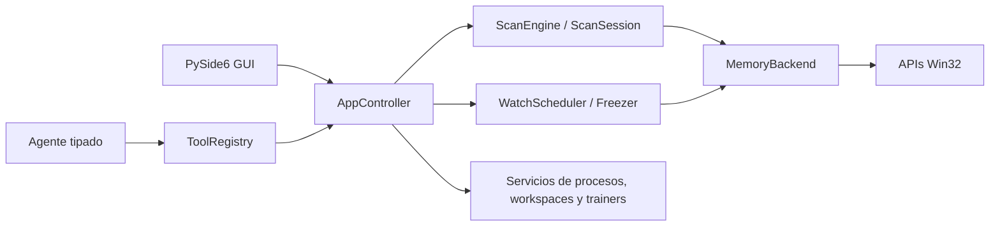

# MemPilot

## Descripción

MemPilot es una aplicación de escritorio para Windows x64 que inspecciona memoria de procesos locales con autorización explícita. Permite adjuntar en lectura o lectura-escritura, hacer primeros escaneos y refinamientos, vigilar y congelar valores, resolver cadenas de punteros y guardar workspaces. El panel de IA usa exclusivamente herramientas tipadas sobre la misma fachada segura que la interfaz; el resto de la aplicación funciona sin IA.

## Capturas

Los huecos y el encuadre esperado están documentados en [`assets/screenshots/README.md`](assets/screenshots/README.md).

- Ventana principal: `assets/screenshots/main-window.png`.
- Flujo de escaneo: `assets/screenshots/scan-results.png`.
- Memory Lab: `assets/screenshots/memory-lab.png`.
- Confirmación del agente: `assets/screenshots/agent-confirmation.png`.

## Requisitos

- Windows 10 u 11 x64.
- Python 3.12 x64 y el lanzador `py` para ejecutar desde fuente.
- PowerShell 5.1 o posterior.
- Permisos equivalentes a los del proceso objetivo. Para procesos elevados, MemPilot también debe iniciarse como administrador.
- Para usar el panel de IA: Antigravity CLI (`agy`), Codex CLI (`codex`) o Claude Code (`claude`) instalado, disponible en `PATH` y con sesión de suscripción iniciada.

## Instalación

```powershell
git clone <ruta-del-repositorio>
cd MemPilot
py -3.12 -m venv .venv
.\.venv\Scripts\python.exe -m pip install -e ".[dev]"
```

No copie `.env`, claves, `build/` ni `dist/` al control de versiones.

## Ejecución

```powershell
.\scripts\run.ps1
.\scripts\run.ps1 --log-level DEBUG
```

`run.ps1` crea `.venv` si falta, instala el proyecto cuando no es importable y reenvía todos los argumentos a MemPilot.

## Memory Lab

Memory Lab es un proceso propio con valores estables (`health`, `coins`, `speed`, `stamina`, texto y bytes) para practicar el ciclo completo sin tocar software de terceros.

```powershell
python tools\memory_lab.py
# o: botón «Iniciar Memory Lab» en MemPilot
```

El botón inicia un proceso separado y pregunta antes de adjuntarse con permiso de escritura; nunca adjunta automáticamente.

## Flujo primer escaneo/siguiente escaneo

1. Pulse `Seleccionar proceso…` y elija lectura o lectura-escritura.
2. Seleccione tipo, condición, valor, regiones y alineación.
3. Pulse **F5** para crear el conjunto inicial. **Esc** cancela sin bloquear la ventana.
4. Cambie el valor en el proceso y pulse **F6** para refinar sólo los candidatos actuales.
5. Use **Ctrl+R** para descartar la sesión conservando el proceso adjunto.
6. Añada resultados a vigilancia; escribir y congelar requieren permiso de escritura.

## Overlay sobre el proceso activo

Con un proceso adjunto en primer plano, pulse **Pause** o **Ctrl+Shift+º** para abrir un
overlay compacto siempre visible. Los atajos son globales, pero MemPilot ignora la activación
si la ventana activa no pertenece exactamente al PID adjunto. **Esc**, **Pause** o
**Ctrl+Shift+º** ocultan el overlay.

El overlay reutiliza la misma conversación y el mismo orquestador del panel principal: muestra
respuestas, actividad de herramientas y confirmaciones sin crear una sesión de IA paralela. La
sección **Trucos guardados** activa o desactiva trainers del proceso actual; **Ajustes manuales**
permite elegir una vigilancia existente, escribir un valor o congelarlo/descongelarlo. Todas esas
operaciones pasan por `AppController`, conservan la auditoría y las confirmaciones, y quedan
deshabilitadas en una sesión de sólo lectura.

Si otra aplicación ya reservó uno de los atajos, MemPilot muestra una advertencia y mantiene el
otro disponible. El teclado español asigna `º` a la tecla situada a la izquierda de `1`.

## Trainers creados con IA

Con una CLI configurada, el botón **Crear trainer con IA** inicia un flujo guiado: el agente
localiza el valor, lo añade a vigilancia y propone probarlo. Confirme en el programa objetivo que
el efecto funciona antes de aceptar **Guardar truco**. Guardar exige una confirmación específica
incluso en modo autónomo y MemPilot vuelve a leer la memoria para comprobar que conserva el valor
activado.

Cada trainer queda asociado al nombre y la arquitectura del ejecutable, en
`%APPDATA%\MemPilot\trainers\<proceso-hash>\trainer.json`. Sólo persiste el nombre del truco, su
tipo, su dirección portable cuando existe, los valores de activación y desactivación y sus notas;
no persiste PID, handles, estado activo ni valores leídos en tiempo de ejecución. Al volver a
adjuntar el mismo proceso, el overlay ofrece el truco inactivo. **Activar** congela el valor o
escribe el valor activado; **Desactivar** descongela o restaura el valor desactivado. Las
activaciones que escriben memoria muestran la confirmación exacta y nunca amplían un adjunto de
sólo lectura.


## Configuración del proveedor de IA

MemPilot usa la sesión ya iniciada en una CLI local; no solicita, lee ni guarda claves de API.
Instale una de las opciones, inicie sesión directamente en ella y compruebe que responde desde
PowerShell:

```powershell
agy --help
codex login status
claude auth status
```

Después abra `Ajustes → IA`, elija **Antigravity CLI**, **Codex CLI** o **Claude Code**. MemPilot
busca `agy`, `codex` o `claude` en `PATH`; `Ejecutable opcional` permite indicar una ruta concreta.
`Modelo opcional` vacío conserva el modelo predeterminado de la CLI. El cambio se aplica al
guardar, sin reiniciar la aplicación.

Cada turno se ejecuta en un directorio temporal vacío, con salida JSON validada. Claude recibe
sus herramientas internas deshabilitadas; Codex recibe su shell y extensiones deshabilitadas;
Antigravity funciona en modo plan/sandbox sin autoaprobar permisos. Las únicas acciones sobre
MemPilot siguen pasando por las 20 herramientas Pydantic, `AppController` y la política local.

En modo **Guiado**, toda escritura o congelado exige confirmación. Activar **Autónomo** muestra
los permisos exactos, fija el proceso, limita el número de escrituras y exige una casilla de
consentimiento; no permite ampliar permisos ni cambiar de proceso. Cambiar de CLI revoca cualquier
concesión autónoma anterior.

## Uso sin IA

```powershell
.\scripts\run.ps1 --no-ai
```

El chat muestra una tarjeta desactivada. Selección de proceso, escaneo, refinamiento, vigilancia, escritura, congelado, punteros, workspaces y Memory Lab permanecen disponibles.

## Workspaces

Un workspace JSON guarda el nombre y arquitectura del proceso, vigilancias y cadenas de punteros; no guarda handles, candidatos, secretos ni estado del agente. La carga valida esquema, proceso y arquitectura antes de restaurar. Las escrituras son UTF-8 y atómicas.

## Generar el ejecutable

```powershell
.\scripts\build.ps1
```

El script ejecuta todas las puertas, limpia `build/` y `dist/`, y genera `dist\MemPilot\MemPilot.exe` en modo `onedir`. El mismo binario acepta:

```powershell
dist\MemPilot\MemPilot.exe
dist\MemPilot\MemPilot.exe --memory-lab
dist\MemPilot\MemPilot.exe --no-ai
```

## Arquitectura



`AppController` es la única fachada de operaciones. Los escaneos, la enumeración y el agente corren en workers; vigilancia, congelado y refresco visible comparten un único planificador. Los resultados se ordenan, filtran y paginan sobre NumPy, no mediante un proxy Qt de millones de filas.

## Solución de problemas

- **Acceso denegado:** el proceso tiene mayor integridad. Cierre MemPilot y reinícielo como administrador; la aplicación no solicita UAC ni se autoeleva.
- **Proceso de 32 bits:** los módulos WOW64 pueden no enumerarse desde MemPilot x64. Use direcciones absolutas; el escaneo sigue disponible.
- **El antivirus marca el `.exe`:** los binarios PyInstaller sin firma y las APIs de memoria pueden generar heurísticas. Compile desde esta fuente, revise el hash y añada una excepción sólo si confía en el artefacto.
- **Qt no encuentra el plugin de plataforma:** reinstale PySide6 en `.venv`; para un build, confirme que existe `dist\MemPilot\_internal\PySide6\plugins\platforms\qwindows.dll`.
- **CLI ausente o sin sesión:** ejecute `agy`, `codex login status` o `claude auth status` fuera de MemPilot; revise el ejecutable y el modelo en `Ajustes → IA`. La inspección manual sigue operativa con `--no-ai`.
- **El overlay no aparece:** confirme que el proceso adjunto, no MemPilot ni otra ventana, está en primer plano; pruebe `Pause` y `Ctrl+Shift+º`. Si otra aplicación reservó un atajo, MemPilot lo indica en la barra de estado.
- **Regiones omitidas en valor desconocido:** aumente `Ajustes → Escaneo → Memoria para escaneo desconocido` o reduzca el rango.

## Límites conocidos

No incluye escáner inverso de punteros, desensamblador ni “find what accesses this address”. No vuelca a disco los escaneos de valor desconocido. La enumeración de módulos WOW64 puede quedar vacía. No evade anti-cheat ni protecciones, no inyecta DLL, no usa drivers y no opera memoria remota.

## Alcance autorizado

Úselo sólo sobre procesos propios o para los que tenga autorización explícita. El usuario elige el proceso y el nivel de acceso; MemPilot bloquea procesos críticos conocidos, oculta procesos sensibles por defecto y mantiene confirmaciones y auditoría local. Consulte [SECURITY.md](SECURITY.md).

## Demostración paso a paso

1. `Seleccionar proceso…` → filtrar `memory_lab` o `python` → adjuntar con escritura. La barra superior muestra PID, `x64` y `Lectura-escritura`.
2. Tipo `Int32`, condición `Valor exacto`, valor `100`, **F5**. La barra de estado avanza y la ventana sigue arrastrable durante el escaneo (comprobación de responsividad); `Esc` cancela.
3. En el laboratorio, `Recibir daño (-27)` → 73.
4. En MemPilot, valor `73`, **F6**. Los candidatos caen a 1 (la dirección coincide con la que muestra el laboratorio).
5. Clic derecho → `Añadir a vigilancia`. Editar `Valor` a `250` → el laboratorio muestra 250.
6. Marcar `Congelado` con deseado `100`; pulsar `Recibir daño` en el laboratorio varias veces: el valor vuelve a 100 cada vez y el log del laboratorio lo refleja.
7. Desmarcar `Congelado`; `Recibir daño` ya funciona.
8. Nuevo escaneo `Float32 = 1.0` → `Velocidad +0.25` → refinar `1.25`. Repetir con `Float64` sobre `stamina`.
9. `stamina`: activar la casilla automática en el laboratorio, escanear `Valor desconocido inicial` en `Float64`, luego refinar `Valor disminuido` dos o tres veces.
10. Escaneo de `Texto UTF-16 LE` con `PlayerOne`, y de `AOB` con `4D 45 4D 50 ?? ?? BE EF`.
11. Guardar workspace, cerrar MemPilot, reabrir, cargar el workspace: las vigilancias vuelven.
12. Panel de chat (con una CLI configurada): «Quiero encontrar la vida. Ahora tengo 100.» → el agente escanea; «Ahora tengo 73.» → refina; con pocos candidatos los añade a vigilancia y pide confirmación antes de escribir.
13. Pulse **Crear trainer con IA**, pruebe el valor propuesto y confirme **Guardar truco**. Abra el overlay sobre Memory Lab, desactive el truco y compruebe que el daño vuelve a funcionar; actívelo y compruebe que la vida vuelve al valor guardado.
14. Con `.\scripts\run.ps1 --no-ai` el chat aparece desactivado y las operaciones manuales, incluidos los trainers ya guardados, siguen funcionando.
15. Cerrar la aplicación y comprobar en el Administrador de tareas que no queda ningún proceso `MemPilot`/`python` huérfano.
